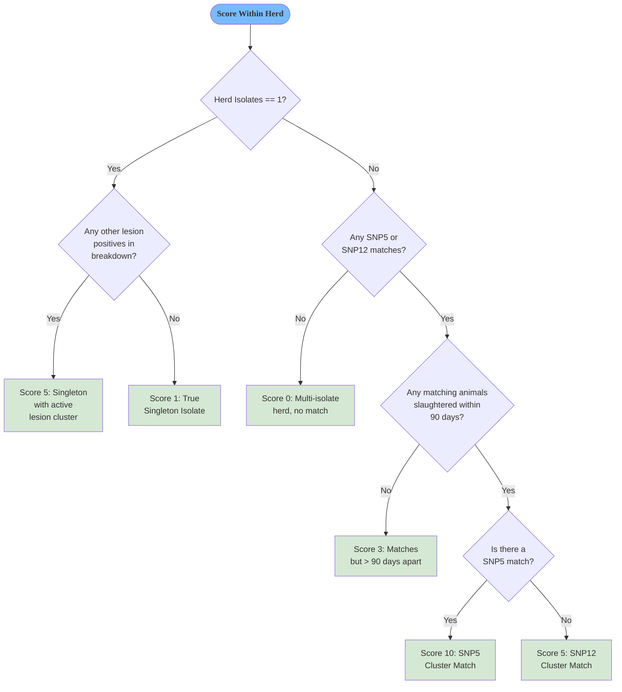
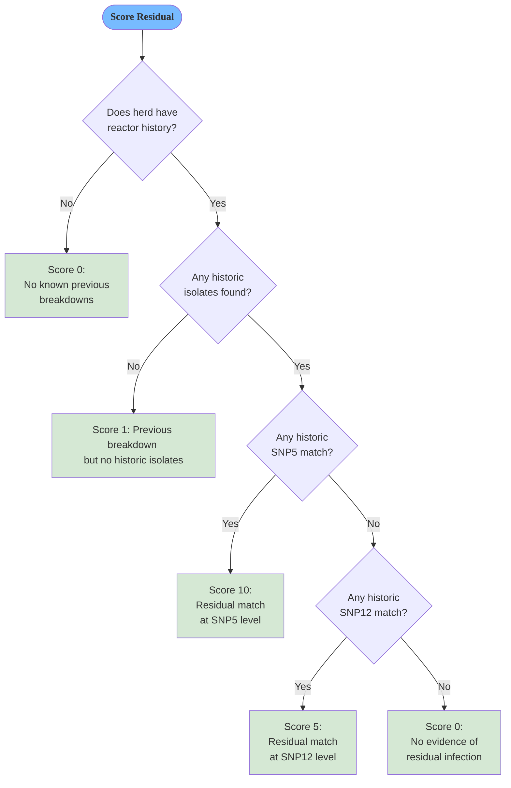
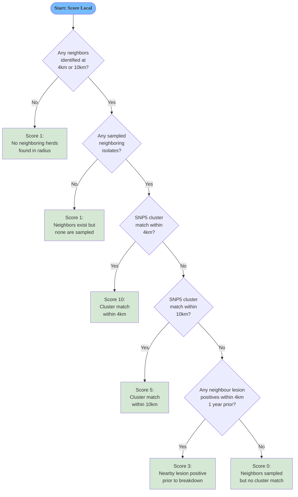
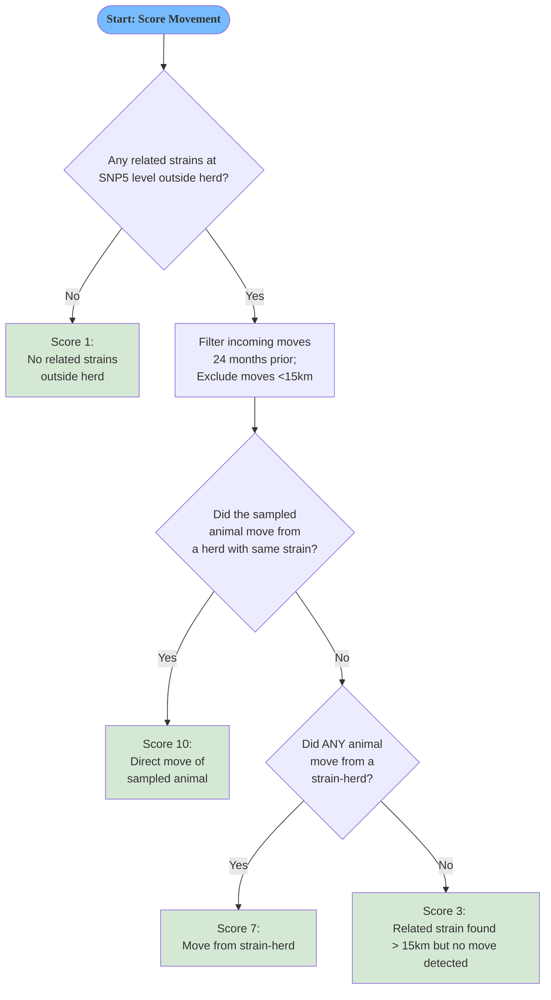

# Source attribution decision trees

## Within-herd

```mermaid
flowchart TD
    
    %% Define Styles
    classDef header font-family:Verdana,font-size:16px,font-weight:bold,fill:#7bf;
    classDef standard font-family:Arial,font-size:14px;
    classDef result font-size:16px,fill:#d5e8d4;
      
    Start([Score Within Herd]):::header --> IsolateCount{Herd Isolates == 1?}
    
    IsolateCount -- Yes --> LesionCheck{Any other lesion <br/>positives in <br/>breakdown?}
    LesionCheck -- Yes --> SingletonLesion[Score 5: Singleton <br/>with active <br/>lesion cluster]:::result
    LesionCheck -- No --> Singleton[Score 1: True <br/>Singleton Isolate]:::result
    
    IsolateCount -- No --> ClusterMatch{Any SNP5 or <br/>SNP12 matches?}
    
    ClusterMatch -- No --> NoMatch[Score 0: Multi-isolate <br/>herd, no match]:::result
    ClusterMatch -- Yes --> TimeCheck{Any matching animals <br/>slaughtered within <br/>90 days?}
    
    TimeCheck -- No --> Distant[Score 3: Matches <br/>but > 90 days apart]:::result
    TimeCheck -- Yes --> SNPType{Is there a <br/>SNP5 match?}
    
    SNPType -- Yes --> SNP5[Score 10: SNP5 <br/>Cluster Match]:::result
    SNPType -- No --> SNP12[Score 5: SNP12 <br/>Cluster Match]:::result
```

## Residual

```mermaid
flowchart TD

    %% Define Styles
    classDef header font-family:Verdana,font-size:16px,font-weight:bold,fill:#7bf;
    classDef standard font-family:Arial,font-size:14px;
    classDef result font-size:16px,fill:#d5e8d4;

    Start([Score Residual]):::header --> HistoryCheck{Does herd have <br/>reactor history?}

    HistoryCheck -- No --> NoHistory[Score 0: <br/>No known previous <br/>breakdowns]:::result
    HistoryCheck -- Yes --> SequenceCheck{Any historic <br/>isolates found?}

    SequenceCheck -- No --> NoSequences[Score 1: Previous breakdown <br/>but no historic isolates]:::result
    SequenceCheck -- Yes --> SNP5Match{Any historic <br/>SNP5 match?}

    SNP5Match -- Yes --> HighScore[Score 10: <br/>Residual match <br/>at SNP5 level]:::result
    SNP5Match -- No --> SNP12Match{Any historic <br/>SNP12 match?}

    SNP12Match -- Yes --> MedScore[Score 5: <br/>Residual match <br/>at SNP12 level]:::result
    SNP12Match -- No --> Default0[Score 0: <br/>No evidence of <br/>residual infection]:::result
```

## Local

```mermaid
flowchart TD
    
    %% Define Styles
    classDef header font-family:Verdana,font-size:16px,font-weight:bold,fill:#7bf;
    classDef standard font-family:Arial,font-size:14px;
    classDef result font-size:16px,fill:#d5e8d4;
  
    Start([Start: Score Local]):::header --> NeighborsExist{Any neighbors <br/>identified at <br/>4km or 10km?}    
    NeighborsExist -- No --> Score1_A[Score 1: <br/>No neighboring herds <br/>found in radius]:::result
    
    NeighborsExist -- Yes --> IsolatesCheck{Any sampled <br/>neighboring <br/>isolates?}    
    IsolatesCheck -- No --> Score1_B[Score 1: <br/>Neighbors exist but <br/>none are sampled]:::result    
    IsolatesCheck -- Yes --> SNP4k{SNP5 cluster <br/>match within <br/>4km?}
    
    SNP4k -- Yes --> Score10[Score 10: <br/>Cluster match <br/>within 4km]:::result    
    SNP4k -- No --> SNP10k{SNP5 cluster <br/>match within <br/>10km?}
    
    SNP10k -- Yes --> Score5[Score 5: <br/>Cluster match <br/>within 10km]:::result 
    SNP10k -- No --> LesionCheck{Any neighbour lesion <br/>positives within 4km <br/> 1 year prior?}
    
    LesionCheck -- Yes --> Score3[Score 3: <br/>Nearby lesion positive <br/>prior to breakdown]:::result   
    LesionCheck -- No --> Score0[Score 0: <br/>Neighbors sampled <br/>but no cluster match]:::result 
```

## Long distance

```mermaid
flowchart TD
    
    %% Define Styles
    classDef header font-family:Verdana,font-size:16px,font-weight:bold,fill:#7bf;
    classDef standard font-family:Arial,font-size:14px;
    classDef result font-size:16px,fill:#d5e8d4;
     
    Start([Start: Score Movement]):::header  --> RelatedCheck{Any related strains at SNP5 level outside herd?}
    
    RelatedCheck -- No --> NoStrain[Score 1: <br/>No related strains <br/>outside herd]:::result
    RelatedCheck -- Yes --> FilterMoves[Filter incoming moves <br/>24 months prior; <br/>Exclude moves <15km]
    
    FilterMoves --> DirectMove{Did the sampled <br/>animal move from <br/>a herd with same strain?}
    
    DirectMove -- Yes --> Score10[Score 10: <br/>Direct move of <br/>sampled animal]:::result  
    DirectMove -- No --> PeerMove{Did ANY animal <br/>move from a <br/>strain-herd?}
    
    PeerMove -- Yes --> Score7[Score 7: <br/>Move from strain-herd <br/>]:::result   
    PeerMove -- No --> Score3[Score 3: <br/>Related strain found <br/>> 15km but no move detected]:::result 
```